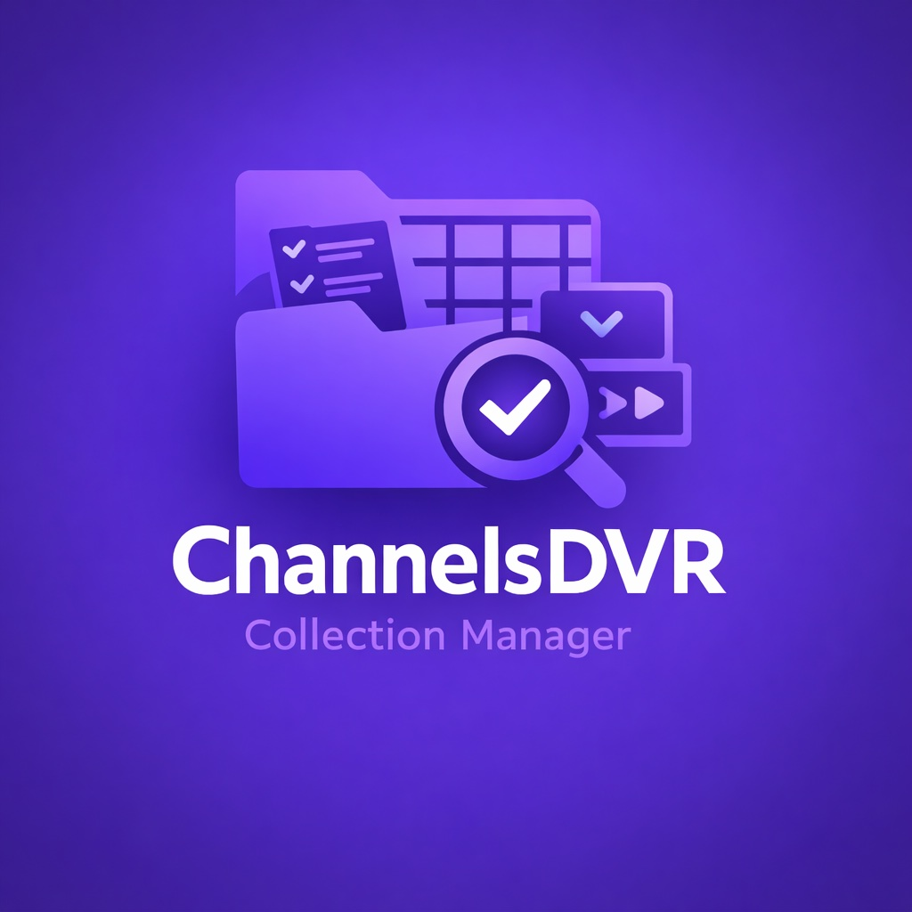

# Channels DVR Collection Manager

A powerful web-based tool for automatically managing channel collections in Channels DVR based on flexible pattern matching rules.


[](https://hub.docker.com/r/curtisfeatures/channels-dvr-collection-manager)
[](https://github.com/CurtisFeatures/channels-dvr-collection-manager)
[](https://opensource.org/licenses/MIT)

## 🎯 What's New in v1.2.0

### Major Features
- **📥📤 Import/Export** - Share rules between installations with duplicate detection
- **📁 Groups/Folders** - Organize rules with collapsible sections
- **🔍 Search & Filter** - Find rules instantly with real-time search
- **🕐 Advanced Scheduling** - Time-based rule activation with day/time windows
- **⚡ Quick Toggle** - Enable/disable rules without opening editor
- **📑 Rule Templates** - Save and reuse pattern configurations
- **✏️ Smart Pattern Editing** - Edit builder-created patterns visually

See [Documentation/CHANGELOG.md](Documentation/CHANGELOG.md) for complete details.

## ✨ Features

### Organization & Management
- **Import/Export Rules** - Backup and share your rule configurations
  - Export all rules or by group
  - Import with merge or replace modes
  - Automatic duplicate detection and warnings
- **Groups/Folders** - Organize rules into collapsible categories
  - Sports, News, Entertainment, IPTV, etc.
  - Autocomplete for existing group names
  - Visual folder icons with expand/collapse
- **Search & Filter** - Find rules quickly
  - Real-time search by name, pattern, or collection
  - Filter by group
  - Combined search + filter support
- **Rule Templates** - Save successful patterns for reuse
  - Build once, use many times
  - Perfect for packaging with releases
  - Include descriptions for documentation

### Advanced Scheduling
- **Time-Based Activation** - Rules run only when scheduled
  - Select specific days of week (Mon-Sun)
  - Set time windows (e.g., 9 AM - 5 PM)
  - Handles overnight ranges (22:00 - 06:00)
  - Visual schedule indicators on rule cards

### Automated Collection Management
- **Pattern-Based Matching** - Use regex patterns to automatically match channels
- **Visual Pattern Builder** - Build patterns without regex knowledge
  - Simple mode with 7 pattern types
  - Advanced mode with multi-condition AND/OR logic  
  - Live preview showing matching channels
  - Smart pattern editing - Edit builder patterns visually
- **Multiple Match Types** - Match on channel name, number, or EPG data
- **Source Filtering** - Include or exclude specific sources
- **Smart Sorting** - Multiple options including "Events Last" for sports
- **Per-Rule Sync** - Custom intervals for each rule
- **Selective Refresh** - Refresh only relevant sources before syncing

### User Experience
- **Quick Enable/Disable Toggle** - Beautiful animated switch on each rule
- **Copy & Clone** - Reuse patterns and duplicate rules
- **Live Preview** - Test patterns before saving
- **ESC Key Support** - Close modals quickly
- **Scrollable Results** - View all matches, not just first few

## 🚀 Quick Start

### Docker Compose (Recommended)

1. Create `docker-compose.yml`:
```yaml
services:
  channels-collection-manager:
    image: curtisfeatures/channels-dvr-collection-manager:latest
    container_name: channels-collection-manager
    ports:
      - "5000:5000"
    environment:
      - DVR_URL=http://your-channels-dvr:8089
      - SYNC_INTERVAL_MINUTES=60
    volumes:
      - ./config:/config
    restart: unless-stopped
```

2. Start the container:
```bash
docker-compose up -d
```

3. Open web interface:
```
http://localhost:5000
```

## 📖 Usage

### Creating Your First Rule

1. **Click "+ Add Rule"**

2. **Basic Settings:**
   - **Name**: e.g., "DAZN Sports Channels"
   - **Group** (Optional): e.g., "Sports" - organizes rules into folders
   - **Collection**: Select from your Channels DVR collections
   - **Match Types**: Channel Name, Number, or EPG

3. **Build Patterns** - Choose your method:

   **Option A: Pattern Builder** (Recommended)
   - Click "Show Builder"
   - **Simple Mode**: Select pattern type and enter text
   - **Advanced Mode**: Combine multiple conditions
   - Click "Test Pattern" to see matches
   - Click "Add This Pattern"
   - **💾 Save as Template** to reuse later!

   **Option B: Use a Template**
   - Click "📑 Templates" in header
   - Browse saved templates
   - Click "Use Template"
   - Pattern auto-fills!

   **Option C: Copy from Another Rule**
   - Expand "📋 Copy Patterns from Another Rule"
   - Select source rule
   - Choose patterns to copy
   - Click "Copy Selected Patterns"

   **Option D: Manual Entry** (For regex experts)
   - Enter pattern directly
   - Click "Test" to preview
   - Click "Add"

4. **Configure Options:**
   - **Sort Order**: Choose how channels are sorted
   - **Source Filters**: Include/exclude specific sources
   - **Sync Interval**: Per-rule override (optional)
   - **Refresh Options**:
     - ☐ Refresh Sources Before Each Sync
     - ☐ Refresh EPG Before Each Sync
   - **Schedule** (Optional):
     - ☑ Enable scheduling
     - Select days of week
     - Set time window (e.g., 9:00 AM - 5:00 PM)

5. **Preview**: Click "Preview" to see complete results

6. **Save**: Rule syncs immediately and on schedule

### Managing Rules

**Quick Enable/Disable:**
- Click the toggle switch next to rule name
- No need to open editor!

**Edit Pattern:**
- Click "Edit" on any pattern
- If created with builder, it opens in builder for visual editing
- If manual regex, opens text prompt

**Clone Rule:**
- Click "📋 Clone" button
- Creates duplicate with " (Copy)" suffix
- Modify and save as new rule

**Organize with Groups:**
- Rules automatically group by folder name
- Click folder header to expand/collapse
- Groups remember their state

**Search & Filter:**
- Use search box to find rules by name, pattern, or collection
- Use group dropdown to show only specific groups
- Combine search + filter for precise results

### Import/Export

**Export Rules:**
1. Click "📤 Export" button
2. File downloads: `channels-rules-YYYY-MM-DD.json`
3. Contains all rules with metadata

**Import Rules:**
1. Click "📥 Import" button
2. Select exported JSON file
3. Preview shows rule count and any duplicates
4. Choose mode:
   - **Merge** (recommended): Adds to existing rules
   - **Replace**: Deletes all, imports new
5. Confirm and import

**Duplicate Detection:**
- Warns if identical rules exist (name + collection + patterns)
- Shows which rules are duplicates
- You can still proceed if intentional

## 🔧 Advanced Features

### Scheduling Examples

**Business Hours Only:**
```
Days: Mon, Tue, Wed, Thu, Fri
Time: 09:00 - 17:00
Use: Sync business news only during work hours
```

**Weekend Sports:**
```
Days: Sat, Sun
Time: 08:00 - 23:00
Use: Activate sports channels on game days
```

**Overnight IPTV Refresh:**
```
Days: (all days)
Time: 02:00 - 05:00
Use: Heavy refresh during low traffic
```

**Midnight Crossing:**
```
Days: (any)
Time: 22:00 - 06:00
Use: Overnight time windows work correctly
```

### Template Workflow

**Create Template:**
1. Build perfect pattern with builder
2. Click "💾 Save as Template"
3. Name: "DAZN Sports Pattern"
4. Description: "All DAZN excluding football"
5. Template saved!

**Use Template:**
1. Click "📑 Templates"
2. Find template
3. Click "Use Template"
4. Pattern + settings auto-fill
5. Just add rule name and collection

**Share Templates:**
- Export rules containing templates
- Share JSON file with others
- They import and get your templates!

### Pattern Examples

**Simple Patterns:**
```
Sport                    # Contains "Sport"
^ESPN                    # Starts with "ESPN"
HD$                      # Ends with "HD"
^ESPN HD$                # Exact match "ESPN HD"
ESPN|FOX|NBC             # Any of these (OR)
^(?!.*Kids).*$           # Does NOT contain "Kids"
100-200                  # Channel range
```

**Advanced Combinations:**
```
^(?!.*football)(?=.*DAZN).*$
# Contains "DAZN" AND Does NOT contain "football"

^(?=.*(Sport|ESPN))Sky.*$
# Contains "Sport" OR "ESPN" AND Starts with "Sky"
```

## 🔌 API

REST API for programmatic access:

### Endpoints

```
GET    /api/rules          # List all rules
POST   /api/rules          # Create rule
PUT    /api/rules/{id}     # Update rule
DELETE /api/rules/{id}     # Delete rule
POST   /api/preview        # Preview matches
GET    /api/status         # Sync status
GET    /api/export         # Export rules
POST   /api/import         # Import rules
GET    /api/groups         # List groups
GET    /api/templates      # List templates
POST   /api/templates      # Save template
DELETE /api/templates/{id} # Delete template
```

## ⚙️ Configuration

### Environment Variables

| Variable | Default | Description |
|----------|---------|-------------|
| `DVR_URL` | `http://channelsdvr:8089` | Channels DVR server URL |
| `SYNC_INTERVAL_MINUTES` | `60` | Global sync interval |

### Rule Structure

```json
{
  "id": "unique-id",
  "name": "Rule Name",
  "group": "Sports",
  "collection_slug": "collection-slug",
  "patterns": ["pattern1", "pattern2"],
  "pattern_metadata": {
    "pattern1": {
      "mode": "simple",
      "type": "contains",
      "value": "ESPN"
    }
  },
  "match_types": ["name", "number"],
  "sort_order": "events_last",
  "include_sources": ["source-id"],
  "exclude_sources": ["source-id"],
  "sync_interval_minutes": 15,
  "refresh_sources_before_sync": true,
  "refresh_epg_before_sync": false,
  "enabled": true,
  "schedule_enabled": false,
  "schedule_days": ["monday", "wednesday", "friday"],
  "schedule_start_time": "09:00",
  "schedule_end_time": "17:00"
}
```

## 🐛 Troubleshooting

### Common Issues

**Rules not syncing:**
- Verify `DVR_URL` is correct and accessible
- Check collections exist in Channels DVR
- View logs: `docker logs channels-collection-manager`
- Check if rule is scheduled and within time window

**Patterns not matching:**
- Use Pattern Builder's live preview
- Test with "Test Pattern" button
- Verify match types are selected
- Check case sensitivity settings

**Import failing:**
- Verify JSON file is valid export format
- Check for file corruption
- Try merge mode instead of replace

**Schedule not working:**
- Verify days are selected
- Check time format is HH:MM
- Look for "skipped" messages in logs

## 📚 Documentation

- [Quick Start Guide](Documentation/QUICKSTART.md)
- [First Rule Guide](Documentation/FIRST_RULE_GUIDE.md)
- [Advanced Features](Documentation/ADVANCED_FEATURES.md)
- [Changelog](Documentation/CHANGELOG.md)

## 🤝 Support

- **Documentation**: [GitHub](https://github.com/CurtisFeatures/channels-dvr-collection-manager)
- **Issues**: [GitHub Issues](https://github.com/CurtisFeatures/channels-dvr-collection-manager/issues)
- **Discussions**: [GitHub Discussions](https://github.com/CurtisFeatures/channels-dvr-collection-manager/discussions)

## 🙏 Contributing

Contributions welcome! See [Documentation/CONTRIBUTING.md](Documentation/CONTRIBUTING.md) for guidelines.

## 📄 License

MIT License - see [LICENSE](LICENSE) file for details.

## 🌟 Acknowledgments

- Built for [Channels DVR](https://getchannels.com/)
- Inspired by the Channels DVR community

## Screenshots


